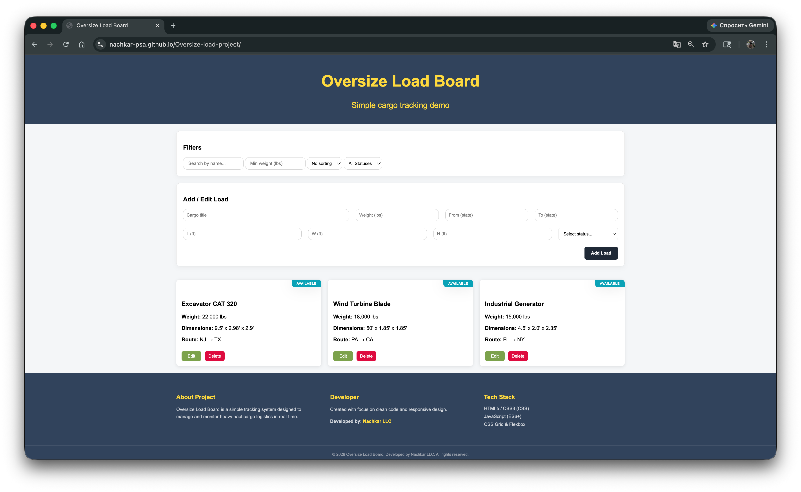
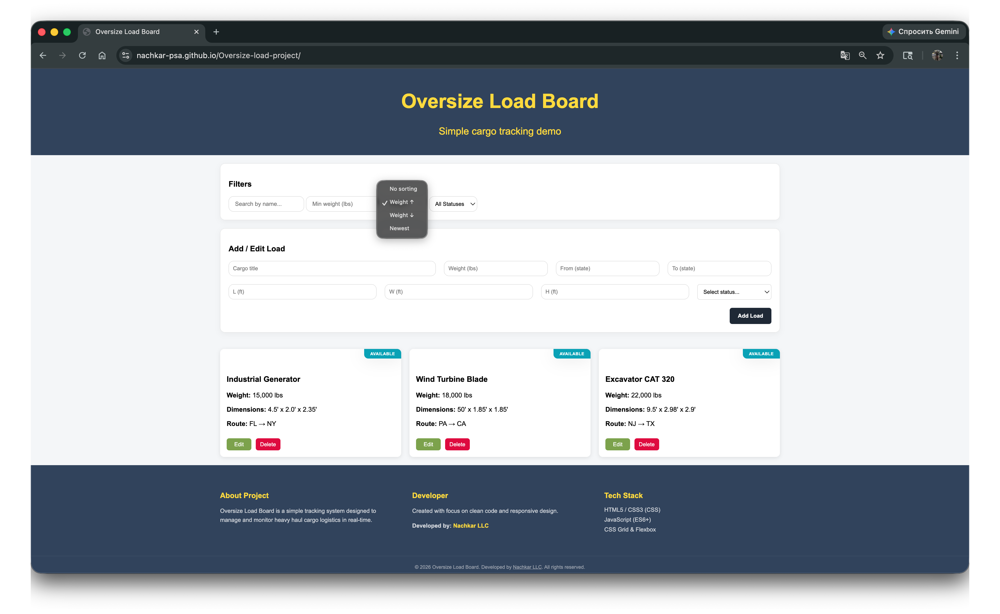
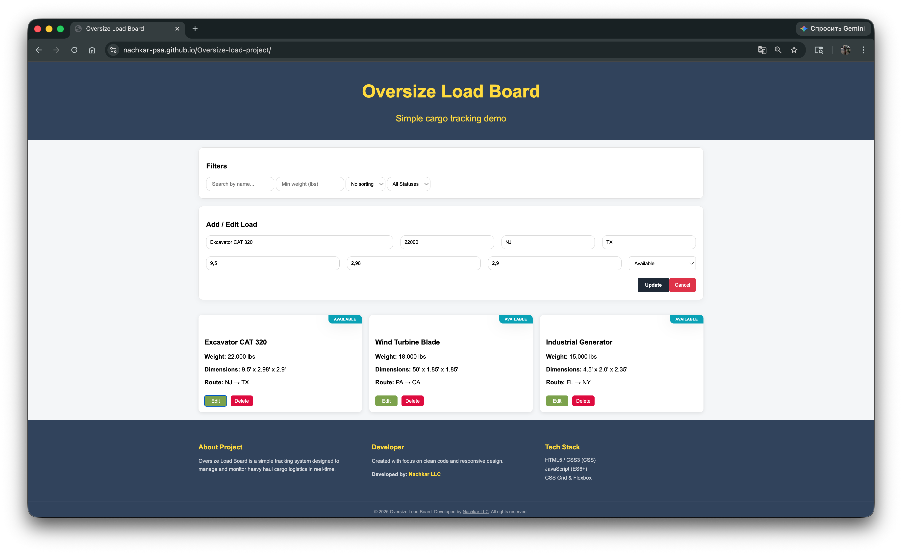

# Shipping Loads Management System 🚛

A lightweight web application for managing oversize freight loads.

This project focuses on building core frontend functionality such as filtering, sorting, state management, and DOM manipulation using pure JavaScript without frameworks.

## ✨ Core Capabilities

- **Full CRUD Functionality:** Seamlessly add, view, edit, and remove shipping loads.
- **Smart Navigation:** Integrated top-level search and filtering system for quick access to specific data.
- **Responsive Architecture:** Fully optimized for all screen sizes, from mobile devices to large desktop monitors.
- **Persistent Storage:** Your data stays safe and accessible even after closing the browser or refreshing the page.

## 🛠 Built With

- **Frontend:** HTML5 & CSS for a robust and polished user interface.
- **Logic:** Modern JavaScript (ES6+) for fast, reactive performance.
- **Styling:** Advanced CSS layouts including Grid and Flexbox for perfect alignment.

## 🧠 Technical Highlights

- Implemented dynamic filtering using .filter() with multiple conditions
- Applied sorting logic using .sort() for different criteria
- Structured code into reusable functions (renderLoads, filteredLoads, createCard)
- Handled data persistence using localStorage
- Built UI state management for editing and updating loads

## 🎯 Future Improvements

- Backend integration (Node.js / API)
- User authentication
- Server-side data storage

## 📷 Screenshots

### Dashboard

### Filters

### Edit Mode

## 🚥 Quick Start

1. Clone this repository to your local machine.
2. Open `index.html` in any modern web browser to start managing your loads.

## 🌐 Live Demo

https://nachkar-psa.github.io/Oversize-load-project/
